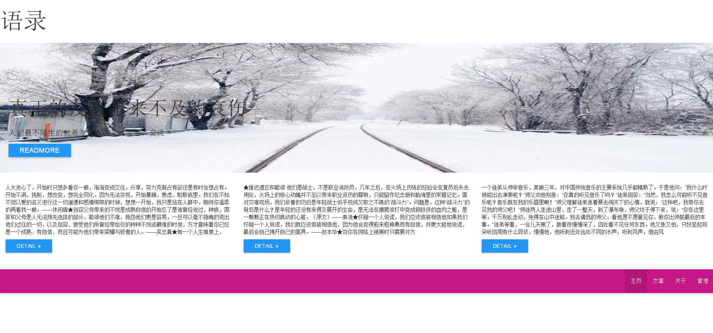
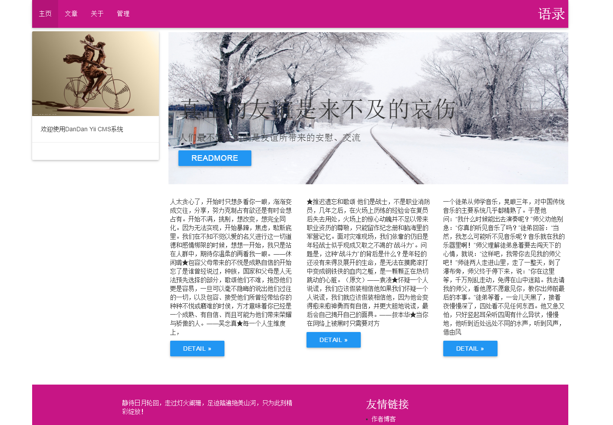

DIRECTORY STRUCTURE
-------------------

	DanDan/
      |---admin/
           |---controllers/     admin controlles
           |---models/          admin models
           |---views/           admin view files
           |---Module.php       admin module defined file
      |---assets/             	contains assets definition
           |---AppAsset.php     Front view asset
           |---AdminAsset.php   Admin view asset
      |---common/             	some common file
           |---widgets/         common widgets
           |---helpers/         common helpers
      |---config/             	contains application configurations
      |---controllers/        	Front Web controller classes
      |---message/            	language package
           |---zh-CN            zh-CN language
      |---models/             	contains model classes
      |---runtime/            	contains files generated during runtime
      |---vendor/             	contains dependent 3rd-party packages
      |---views/              	contains view files for the Web application
      |---web/                	contains the entry script and Web resources

REQUIREMENTS
------------

The minimum requirement by this application template that your Web server supports PHP 5.4.0.

INSTALLATION
------------

### Install from an Archive File

clone the code, and make composer update to download require lib.

CONFIGURATION
-------------

### Database

Edit the file `config/db.php` with real data, edit default view params in
config/view.php.

import data from data.sql

SOME EXAMPLE
------------
*   theme [zendefault](themes/zendefault)

*   theme [zendefault](themes/tfviolet)

